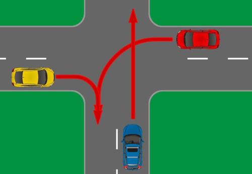
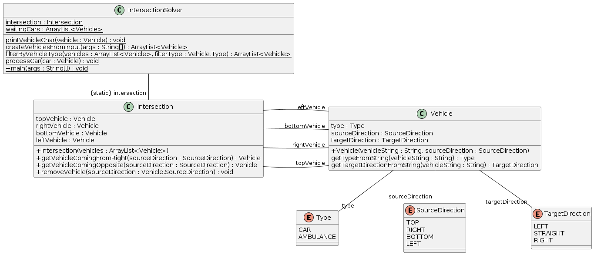

# IntersectionSolver

This command line application can be used to solve intersection problems that involve an intersection of equivalent roads.



# Table of Contents

- [User manual](#user-manual)
- [Developer documentation](#developer-documentation)

# User manual

After cloning this repository, you can build the application using Maven:

```
mvn compile
```

Then, you can run the application with the following command:

```
java -cp target/classes org.IncQuery.IntersectionSolver <input>
```

Four input parameters should be provided. These strings should denote each of the vehicles arriving from the top, from the right, from the bottom and from the left (in this order).

If there is no vehicle arriving from a direction, it should be denoted by a `_` character. Otherwise, each string should consist of two letters. The first letter denotes the type of the vehicle:

- `C`: car
- `A`: ambulance

The second letter denotes the target direction of the vehicle:

- `L`: left
- `S`: straight
- `R`: right

For example, the intersection pictured above can be represented with the following input:

```
_ CL CS CR
```

The output of the application is the order in which the vehicles can cross the intersection (following the traffic rules). Each vehicle is denoted by its source direction.  For the intersection above, the output is:

```
LRB
```

# Developer documentation

## Research

As the traffic rules were not provided in the exercise description, I checked the Hungarian traffic code ([KRESZ](https://net.jogtar.hu/jogszabaly?docid=97500001.kpm)). The relevant traffic rules in this context are the following:

- Priority must be given at the intersection to all ambulances.
- A car must give right of way to other cars coming from its right.
- A left-turning car must give right of way to a car coming from the opposite direction if the other car is going straight or turning right.

The combination of the second and the third rule means that a car turning right can cross at any time (if there is no ambulance coming).

Some cases are not specified in the traffic code. These are the following:

- Multiple ambulances crossing the intersection at the same time
- All cars are waiting for another car (deadlock)
- Two cars arrive from the opposite direction and turn to the left

In the implementation, multiple ambulances are allowed to pass the intersection in the order of the input. If there is a deadlock, the first car that was added to the waiting list is allowed to pass the intersection and the other cars are processed again.

## Implementation

The implementation consists of three classes: `IntersectionSolver`, `Intersection` and `Vehicle`. The following UML diagram provides an overview of the classes and enums.



### IntersectionSolver
Implements the process of determining the order of the vehicles.

#### main

This is the entrypoint of the application. After processing the input parameters, the ambulances and cars are processed separately.

#### createVehiclesFromInput

Creates the list of vehicles from the command line arguments and returns it.

#### filterByVehicleType

Filters the given list of vehicles by the given vehicle type and returns the filtered list.

#### processCar

Decides whether the car received as a parameter can cross the intersection based on its target direction and the other cars in the intersection.

#### printVehicleChar

Prints a vehicle's character, the first letter of the source direction to the standard output.

### Intersection

Represents the intersection, provides functions to check and update its status.

#### Constructor

Receives the list of vehicles and stores the vehicles.

#### getVehicleComingFromRight

Receives a source direction and from the POV of the vehicle arriving from this direction, returns the vehicle coming from the right.

#### getVehicleComingOpposite

Receives a source direction and from the POV of the vehicle arriving from this direction, returns the vehicle coming from the opposite direction.

#### removeVehicle

Removes a vehicle from the intersection.

### Vehicle

Represents a vehicle (a car or an ambulance).

#### Constructor

Receives and stores a vehicle's data.

#### getTypeFromString

Returns a vehicle type based on the vehicle's input string.

#### getTargetDirectionFromString

Returns a target direction based on the vehicle's input string.